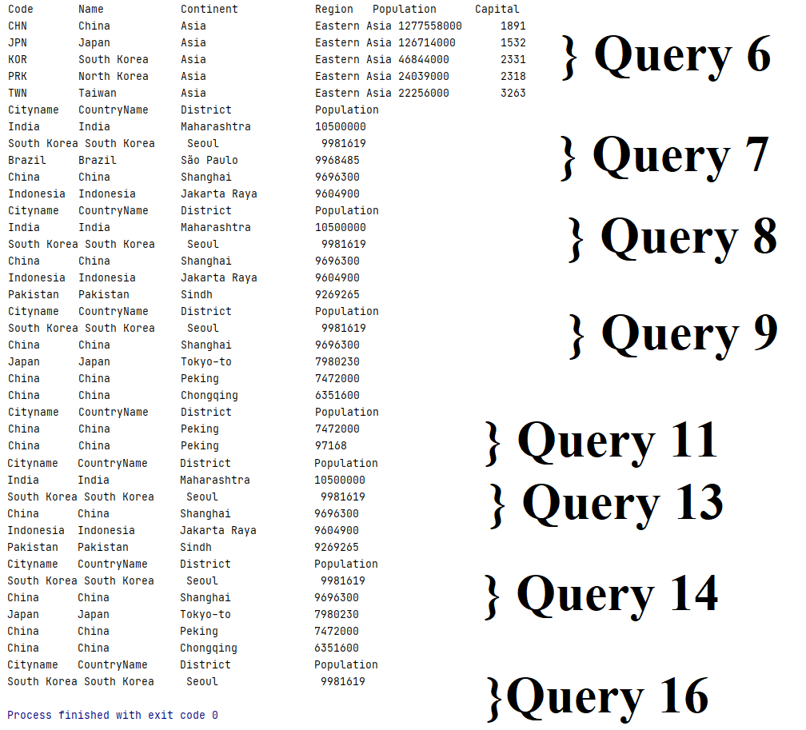

# Software Engineering Methods

- Master Build Status 
- Develop Build Status 
- Code Coverage 
- License 
- Release 

# Requirements

| ID    | Name | Met  | Screenshot |
|-------|------|------|------------|
| 1     | All the countries in the world organised by largest population to smallest. | Yes | image |
| 2     | All the countries in a continent organised by largest population to smallest. | Yes | image   |
| 3     | All the countries in a region organised by largest population to smallest. | Yes | image |
| 4     | The top N populated countries in the world where N is provided by the user. | Yes | image |
| 5     | The top N populated countries in a continent where N is provided by the user. | Yes | image  |
| 6     | The top N populated countries in a region where N is provided by the user. | Yes | image |
| 7     | All the cities in the world organised by largest population to smallest. | Yes | image |
| 8     | All the cities in a continent organised by largest population to smallest. | Yes | image  |
| 9     | All the cities in a region organised by largest population to smallest. | Yes | image |
| 10     | All the cities in a country organised by largest population to smallest. | No |  |
| 11     | All the cities in a district organised by largest population to smallest. | Yes | image |
| 12     | The top N populated cities in the world where N is provided by the user. | No |   |
| 13     | The top N populated cities in a continent where N is provided by the user. | Yes | image |
| 14     | The top N populated cities in a region where N is provided by the user. | Yes | image |
| 15     | The top N populated cities in a country where N is provided by the user. | No |   |
| 16     | The top N populated cities in a district where N is provided by the user. | Yes | image |
| 17     | All the capital cities in the world organised by largest population to smallest. | No |   |
| 18     | All the capital cities in a continent organised by largest population to smallest. | No |  |
| 19     | All the capital cities in a region organised by largest to smallest. | No |  |
| 20     | The top N populated capital cities in the world where N is provided by the user. | No |   |
| 21     | The top N populated capital cities in a continent where N is provided by the user. | No |  |
| 22     | The top N populated capital cities in a region where N is provided by the user. | No |   |
| 23     | The population of people, people living in cities, and people not living in cities in each continent. | No |  |
| 24     | The population of people, people living in cities, and people not living in cities in each region. | No |  |
| 25     | The population of people, people living in cities, and people not living in cities in each country. | No |   |
| 26     | The population of the world. | No |  |
| 27     | The population of a continent. | No |   |
| 28     | The population of a region. | No | |
| 29     | The population of a country. | No |  |
| 30     | The population of a district. | No |   |
| 31     | The population of a city. | No |  |
| 32     | World Population Languages | No |  |

# Images

